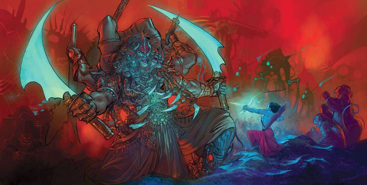
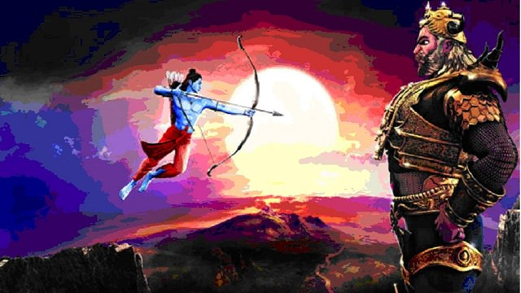

# :tropical_fish: :flipper:   Failing Fishing Attempt :shark: :tropical_fish:
.jpg)
## Last weekend I was bored and I had nothing to do. all my friends and family members were busy, so no one was able to spent time with me. I started thinking "what can i do ?" and suddenly i came up with idea... I can go finshing i  took my fishing rod, hooks, and worms for bait. I reached the jetty and threw the line with the bait into the water and started waiting. there were too many other fishermen. they were all happy, catching a lot of fishes. meanwhile I was sitting frustrated as I couldn’t catch a single fish! .. and I was wondering why I can’t catch some fish and be happy like them after few hours the fishermen started to leave one by one. and eventually I remained alone with an empty bucket. I felt so sad, but after a while I looked at the horizon to see the sunset! it was an amazing scene and a group of seagulls were flying, singing over the golden light of the sun that was reflected on the water Then I felt a great happiness deep inside! I was the only one seeing that view and then i realized that happiness can come in different ways and different ways different reasons.

Inorder to conquer the world, Ravan asked Brahma for the gift of immortality,but Brahma said -
>*"Death is certain, my  child!". You must die after being born into this world. So I am unable to give you the blessing of immortality. You may ask for something else!"*

Then the ambitiuos Ravan said -
>*"O Brahma, May no god or heavenly spirit kill me. Oh Lord! may no demon, monster or beast defaet me! Give me the blessing of victory over all these!" Brahma also said, "Tathasthu! and he disappeared.*

Blinded by his power and might, the foolish Ravan thought no mankind could harm him. Man is like a hunt for him, which can be easily trampled and defeated. His mistake was that he considered mankind weak. That is why Shri Ram was able to cut of all his 10 head and kill him ruthlessly.

## Conclusion
No one should boast about his powers and consider others weak. Even a small ant can cause the death of such a huge elephant. Nature plays its own game. It is unparallelled. Mighty lion, The king of the jungle, cannot be defeated by anyone else, but he is preyed  upon by small flies and insects.
